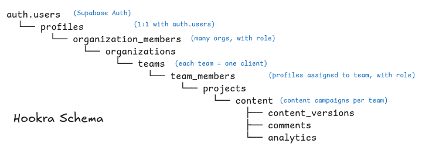

# Hookra Database

## Overview

Hookra is a content collaboration platform for marketing agencies. The schema models the hierarchy:

```
Auth User → Profile → Org → Team → Project → Content
```

Agencies own orgs. Each org has teams, where each team represents one client. Teams contain projects (campaigns), and projects contain content pieces that go through a review/approval workflow.

---

## Tables

### `profiles`

One row per Supabase Auth user. Auto-created by a trigger on `auth.users` INSERT.

| Column | Type | Notes |
|---|---|---|
| `id` | uuid PK | References `auth.users` — cascades on delete |
| `email` | text | Unique, NOT NULL |
| `first_name` | text | From `raw_user_meta_data` at signup |
| `last_name` | text | From `raw_user_meta_data` at signup |
| `avatar_url` | text | Optional |
| `created_at` | timestamptz | |
| `updated_at` | timestamptz | Auto-stamped by trigger |

---

### `orgs`

An organization — typically a marketing agency or solo freelancer.

| Column | Type | Notes |
|---|---|---|
| `id` | uuid PK | |
| `name` | text | Display name |
| `slug` | text | Unique, URL-safe identifier (e.g. `"rembrand"`) |
| `logo_url` | text | Optional |
| `owner_id` | uuid | FK → `profiles.id`, RESTRICT on delete |
| `created_at` | timestamptz | |
| `updated_at` | timestamptz | Auto-stamped by trigger |

When an org is created, a trigger automatically inserts the `owner_id` into `org_members` with role `owner`.

---

### `org_members`

Tracks which profiles belong to which org and their role.

| Column | Type | Notes |
|---|---|---|
| `id` | uuid PK | |
| `org_id` | uuid | FK → `orgs.id`, CASCADE delete |
| `profile_id` | uuid | FK → `profiles.id`, CASCADE delete |
| `role` | `org_role` | `owner`, `admin`, or `member` |
| `invited_by` | uuid | FK → `profiles.id`, SET NULL on delete |
| `joined_at` | timestamptz | |

**Unique constraint:** `(org_id, profile_id)`

**Org roles:**

| Role | Capabilities |
|---|---|
| `owner` | Full control, can delete org, cannot be removed |
| `admin` | Manage members, teams, all content |
| `member` | Create/edit content, no org settings access |

---

### `teams`

A team represents one client inside an organization. Example: `"Crumbly"` inside `"Rembrand"`.

| Column | Type | Notes |
|---|---|---|
| `id` | uuid PK | |
| `org_id` | uuid | FK → `orgs.id`, CASCADE delete |
| `name` | text | Unique per org |
| `description` | text | Optional |
| `logo_url` | text | Optional |
| `created_by` | uuid | FK → `profiles.id`, SET NULL on delete |
| `created_at` | timestamptz | |
| `updated_at` | timestamptz | Auto-stamped by trigger |

**Unique constraint:** `(org_id, name)`

---

### `team_members`

Tracks access to a team. Includes both agency-side staff and client users.

| Column | Type | Notes |
|---|---|---|
| `id` | uuid PK | |
| `team_id` | uuid | FK → `teams.id`, CASCADE delete |
| `profile_id` | uuid | FK → `profiles.id`, CASCADE delete |
| `role` | `team_role` | `manager`, `editor`, or `client` |
| `invited_by` | uuid | FK → `profiles.id`, SET NULL on delete |
| `joined_at` | timestamptz | |

**Unique constraint:** `(team_id, profile_id)`

**Team roles:**

| Role | Side | Capabilities |
|---|---|---|
| `manager` | Agency | Full control of team content and settings |
| `editor` | Agency | Create and edit content, cannot approve |
| `client` | Client | View, comment, and approve/reject content |

---

### `projects`

A content campaign or initiative within a team. Example: `"Summer Sale 2025"` inside `"Crumbly"`.

| Column | Type | Notes |
|---|---|---|
| `id` | uuid PK | |
| `team_id` | uuid | FK → `teams.id`, CASCADE delete |
| `name` | text | |
| `description` | text | Optional |
| `status` | text | `active`, `paused`, `completed`, `archived` |
| `created_by` | uuid | FK → `profiles.id`, SET NULL on delete |
| `created_at` | timestamptz | |
| `updated_at` | timestamptz | Auto-stamped by trigger |

---

### `content`

A single content piece belonging to a project. Structured around the Hookra workflow: hook → script → caption → cta → hashtags.

| Column | Type | Notes |
|---|---|---|
| `id` | uuid PK | |
| `project_id` | uuid | FK → `projects.id`, CASCADE delete |
| `created_by` | uuid | FK → `profiles.id`, SET NULL on delete |
| `title` | text | |
| `platform` | `content_platform` | `instagram`, `tiktok`, `facebook`, `linkedin`, `twitter`, `youtube` |
| `format` | `content_format` | `reel`, `story`, `post`, `video`, `image`, `carousel`, `text` |
| `status` | `content_status` | See workflow below |
| `ai_prompt` | text | Prompt sent to AI |
| `ai_model` | text | Model used, e.g. `"claude-sonnet-4-6"` |
| `hook` | text | Attention-grabbing opening line |
| `script` | text | Full script or body copy |
| `caption` | text | Platform caption |
| `cta` | text | Call to action |
| `hashtags` | text[] | Array for easy filtering |
| `published_at` | timestamptz | |
| `published_url` | text | |
| `current_version` | int | Increments on each content field edit |
| `created_at` | timestamptz | |
| `updated_at` | timestamptz | Auto-stamped by trigger |

**Content workflow (`content_status`):**

```
draft → in_review → changes_requested → in_review → approved → published → archived
```

| Status | Meaning |
|---|---|
| `draft` | Being worked on by agency |
| `in_review` | Sent to client for approval |
| `changes_requested` | Client asked for revisions |
| `approved` | Client approved, ready to publish |
| `published` | Live on the platform |
| `archived` | No longer active |

---

### `content_versions`

Immutable snapshots of content fields before each edit. Version N = what content looked like before edit N+1 was made. Written only by trigger — no direct client insert allowed.

| Column | Type | Notes |
|---|---|---|
| `id` | uuid PK | |
| `content_id` | uuid | FK → `content.id`, CASCADE delete |
| `version_number` | int | |
| `hook` | text | |
| `script` | text | |
| `caption` | text | |
| `cta` | text | |
| `hashtags` | text[] | |
| `saved_by` | uuid | FK → `profiles.id`, SET NULL on delete |
| `created_at` | timestamptz | |

**Unique constraint:** `(content_id, version_number)`

---

### `comments`

Threaded comments on a content piece. Any team member (agency or client) can comment.

| Column | Type | Notes |
|---|---|---|
| `id` | uuid PK | |
| `content_id` | uuid | FK → `content.id`, CASCADE delete |
| `author_id` | uuid | FK → `profiles.id`, CASCADE delete |
| `parent_id` | uuid | FK → `comments.id`, CASCADE delete — for threaded replies |
| `body` | text | |
| `resolved` | bool | Default `false` |
| `resolved_by` | uuid | FK → `profiles.id`, SET NULL on delete — auto-set by trigger |
| `resolved_at` | timestamptz | Auto-stamped by trigger when `resolved` flips to `true` |
| `created_at` | timestamptz | |
| `updated_at` | timestamptz | Auto-stamped by trigger |

---

### `analytics`

Periodic performance snapshots per content piece. Multiple rows per content (one per `recorded_at`). Inserted by server-side sync jobs via `service_role` only — no direct client writes.

| Column | Type | Notes |
|---|---|---|
| `id` | uuid PK | |
| `content_id` | uuid | FK → `content.id`, CASCADE delete |
| `platform` | `content_platform` | |
| `views` | bigint | Cumulative |
| `likes` | bigint | Cumulative |
| `comments` | bigint | Cumulative |
| `shares` | bigint | Cumulative |
| `saves` | bigint | Cumulative |
| `reach` | bigint | Unique accounts reached |
| `impressions` | bigint | |
| `engagement_rate` | numeric(6,4) | `(likes+comments+shares+saves) / reach`, computed at snapshot time |
| `recorded_at` | timestamptz | |

**Unique constraint:** `(content_id, recorded_at)`

**View:** `analytics_latest` — latest snapshot per content piece via `DISTINCT ON (content_id) ORDER BY recorded_at DESC`.

---

## Helper Functions

| Function | Returns | Purpose |
|---|---|---|
| `get_member_org_ids(profile_id)` | `SETOF uuid` | All org IDs a profile belongs to — used heavily in RLS |
| `get_org_role(profile_id, org_id)` | `org_role` | Role in org, `NULL` if not a member |
| `get_team_role(profile_id, team_id)` | `team_role` | Role in team, `NULL` if not a member |

---

## Triggers

| Trigger | Table | When | Action |
|---|---|---|---|
| `trg_profiles_updated_at` | `profiles` | BEFORE UPDATE | Stamp `updated_at` |
| `trg_on_auth_user_created` | `auth.users` | AFTER INSERT | Create profile row from `raw_user_meta_data` |
| `trg_orgs_updated_at` | `orgs` | BEFORE UPDATE | Stamp `updated_at` |
| `trg_on_org_created` | `orgs` | AFTER INSERT | Insert owner into `org_members` with role `owner` |
| `trg_teams_updated_at` | `teams` | BEFORE UPDATE | Stamp `updated_at` |
| `trg_projects_updated_at` | `projects` | BEFORE UPDATE | Stamp `updated_at` |
| `trg_content_updated_at` | `content` | BEFORE UPDATE | Stamp `updated_at` |
| `trg_content_version_snapshot` | `content` | BEFORE UPDATE | Snapshot old content fields into `content_versions` if `hook/script/caption/cta/hashtags` changed |
| `trg_comments_updated_at` | `comments` | BEFORE UPDATE | Stamp `updated_at` |
| `trg_comment_resolved_at` | `comments` | BEFORE UPDATE | Stamp `resolved_at` and `resolved_by` when `resolved` flips; clear them when unresolved |

---

## Indexes

| Index | Table | Column(s) |
|---|---|---|
| `idx_org_members_profile` | `org_members` | `profile_id` |
| `idx_org_members_org` | `org_members` | `org_id` |
| `idx_team_members_profile` | `team_members` | `profile_id` |
| `idx_team_members_team` | `team_members` | `team_id` |
| `idx_teams_org` | `teams` | `org_id` |
| `idx_projects_team` | `projects` | `team_id` |
| `idx_content_project` | `content` | `project_id` |
| `idx_content_status` | `content` | `status` |
| `idx_content_platform` | `content` | `platform` |
| `idx_content_versions_content` | `content_versions` | `content_id` |
| `idx_comments_content` | `comments` | `content_id` |
| `idx_comments_author` | `comments` | `author_id` |
| `idx_comments_parent` | `comments` | `parent_id` |
| `idx_analytics_content` | `analytics` | `content_id` |
| `idx_analytics_recorded_at` | `analytics` | `recorded_at DESC` |

---

## Schema Diagram


